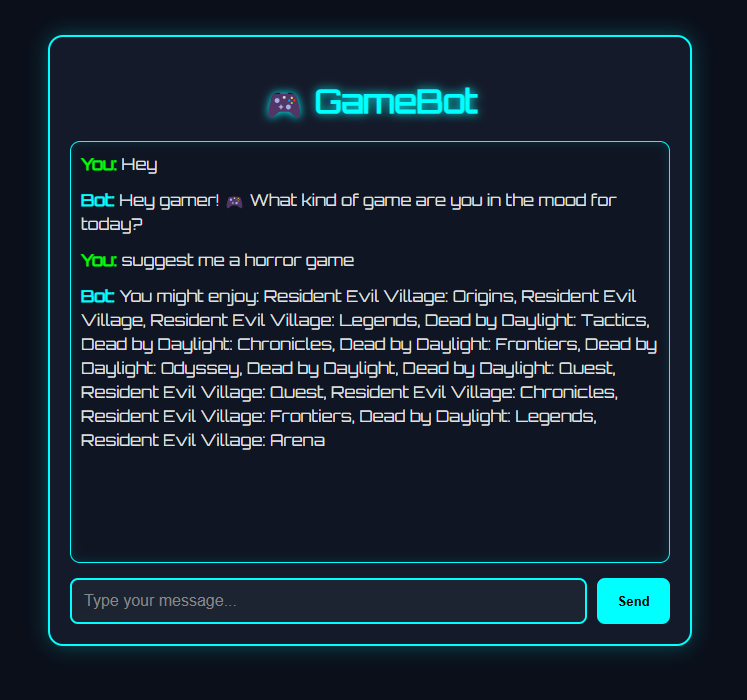

# 🎮 Game Suggestion AI Chatbot

An intelligent AI-powered chatbot that recommends games based on your mood, genre, platform, and difficulty level — all through a fun gamer-style chat UI!

## 🧠 Features

- Smart ML model that understands natural messages
- Gamer-themed UI with dark mode & neon glow
- Detects casual chat vs game requests
- Prevents repeated “no match” replies
- Runs 100% offline using scikit-learn & Flask

## 🚀 Live Demo 
> You can deploy this to Render, Railway, or Replit (DM for help!)

## 📂 Project Structure

game-suggester-bot-ai/ ├── app.py ├── train_model.py ├── games.json ├── requirements.txt ├── model/ │ └── game_classifier.pkl ├── data/ │ └── training_data.csv ├── templates/ │ └── index.html ├── static/ │ └── style.css


## 🛠️ Tech Stack

- Python 3.12
- Flask
- Scikit-learn
- Pandas
- HTML/CSS/JS
- HuggingFace Transformers (optional for advanced version)

## 🧪 How to Run Locally

```bash
git clone https://github.com/akshajsun/game-suggester-bot-ai.git
cd game-suggester-bot-ai
pip install -r requirements.txt
python train_model.py   # (only once to generate model)
python app.py
```
Then open http://127.0.0.1:5000 in your browser.

## 🖼️ UI Preview


## 📄 License
MIT License 

## 🙋‍♂️ Author
Akshaj S ,
Gautam Girish
